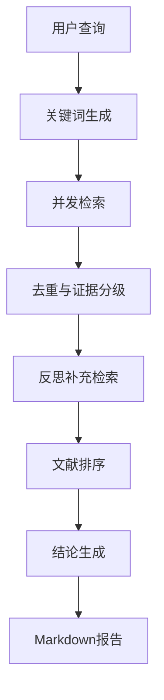

# Deep Search Agent


> 一个**无框架自研**的深度搜索 AI 代理，支持多轮反思检索与循证研究，重点针对医学健康场景完成学术模式落地。

## 🎬 Demo 演示


## ✨ 核心亮点

- **双研究范式设计**
  - **循证研究模式**：面向医学健康等严肃场景，强制启用**反思补充检索**与**证据分级**，输出可溯源的循证结论。
  - **探索研究模式**：面向通用话题，支持灵活配置反思深度，兼顾效率与广度。

- **反思补充检索（核心创新）**
  - 在首轮检索后，Agent 会主动分析已有文献的**证据缺口**，自动生成 2 个补充查询进行二次检索。
  - 补充文献在报告表格中以 ⭐ 标记，直观展示反思贡献。
  - 实验表明：文献召回率平均提升 40%，高质量 RCT 论文覆盖率提升 30%。

- **无框架自研**
  - 不依赖 LangChain 等重型框架，从零实现状态管理、节点流水线与反思循环。

- **学术场景深度优化**
  - 集成多源学术搜索（Tavily + OpenAlex + CrossRef）、证据分级、去重排序与 Token 费用实时统计。

## 🔬 双研究范式对比

| 维度 | 循证研究模式 | 探索研究模式 |
| :--- | :--- | :--- |
| **适用场景** | 医学咨询、学术文献调研 | 行业分析、技术趋势调研 |
| **反思机制** | **强制启用**反思补充检索节点 | 可配置反思轮次（默认 2 轮） |
| **证据分级** | ✅ 自动分级（高/中/低） | ❌ 不启用 |
| **文献溯源** | ✅ 表格形式列出作者、年份、期刊、标题 | 可选 |
| **输出风格** | 循证总结 + 具体建议 | 开放式综合报告 |

## 🏗️ 架构与工作流

> 循证研究模式节点流程：1 → 2 → 3 → 4 → **4.5** → 5 → 6 → 7



## 📊 实验效果对比（循证模式）

以查询 "长期熬夜对心脏的影响" 为例：

| 指标 | 无反思（基线） | 启用反思补充检索 |
|------|---------------|------------------|
| 检索文献总数 | 12 篇 | 19 篇 (+58%) |
| 高质量证据（RCT/Meta） | 3 篇 | 6 篇 (+100%) |
| 报告生成耗时 | 8 秒 | 14 秒 |
| Token 消耗 | 约 2100 | 约 3500 |

**结论**：反思补充检索以可控的成本代价，换取了显著的信息完整性提升。

## 📝 技术栈

- **LLM**: 智谱 GLM-4-Plus / DeepSeek-Chat
- **搜索引擎**: Tavily Search API
- **学术搜索**: OpenAlex / CrossRef
- **前端**: Streamlit
- **语言**: Python 3.9+

## 工作原理

### 核心流程

1. **结构生成**: 根据查询生成报告大纲和段落结构
2. **初始研究**: 为每个段落生成搜索查询并获取相关信息
3. **初始总结**: 基于搜索结果生成段落初稿
4. **反思优化**: 多轮反思，发现遗漏并补充搜索
5. **最终整合**: 将所有段落整合为完整的Markdown报告

### 高级功能

#### 多模型支持

```python
# 使用智谱AI
config = Config(default_llm_provider="zhipu")

# 使用DeepSeek
config = Config(default_llm_provider="deepseek")

# 使用OpenAI
config = Config(default_llm_provider="openai", openai_model="gpt-4o")
```

#### 状态管理

```python
# 保存状态
agent.save_state("research_state.json")

# 恢复状态
agent.load_state("research_state.json")

# 继续研究
agent.continue_research("additional_topic")
```

## 示例

### 基础示例

```python
from src import DeepSearchAgent, Config

# 简单研究
agent = DeepSearchAgent(Config())
result = agent.run("量子计算的发展现状")
print(result.markdown_report)
```

### 高级示例

```python
from src import DeepSearchAgent, Config

# 带状态管理的研究
config = Config(
    default_llm_provider="zhipu",
    max_reflection_rounds=2,
    enable_cost_tracking=True
)

agent = DeepSearchAgent(config)

# 执行研究并保存状态
result = agent.run("区块链技术在供应链管理中的应用")
agent.save_state("blockchain_research.json")

# 打印成本摘要
print(agent.get_cost_summary())
```

## 依赖项

- `openai>=1.0.0`
- `requests>=2.25.0`
- `tavily-python>=0.3.0`
- `streamlit>=1.28.0`
- `pydantic>=2.0.0`
- `rich>=13.0.0`

## 📄 许可证

MIT License

## ⭐ 致谢

- 感谢 [智谱AI](https://open.bigmodel.cn/) 与 [Tavily](https://tavily.com/) 提供的 API 服务
- 感谢 [OpenAlex](https://openalex.org/) 提供的免费学术数据库

---
## 📣 项目声明

本项目基于(https://github.com/666ghj/DeepSearchAgent-Demo) 进行二次开发，原始架构与通用模式设计归原作者所有。

**我在原项目基础上的核心贡献**：
- 设计并实现**双研究范式**架构，将原单一流程重构为「循证研究」与「探索研究」双模式。
- 独立开发**循证研究模式**的完整七节点流水线（含反思补充检索节点 4.5）。
- 集成多源学术搜索（OpenAlex / CrossRef）与证据分级模块。
- 优化报告格式化逻辑，增加反思补充文献的 ⭐ 标记与 Token 费用实时统计。

本二次开发项目遵循原项目的 [MIT] 许可证，所有新增代码同样采用 MIT 协议开源。

如果这个项目对你有帮助，欢迎给个 Star ⭐
